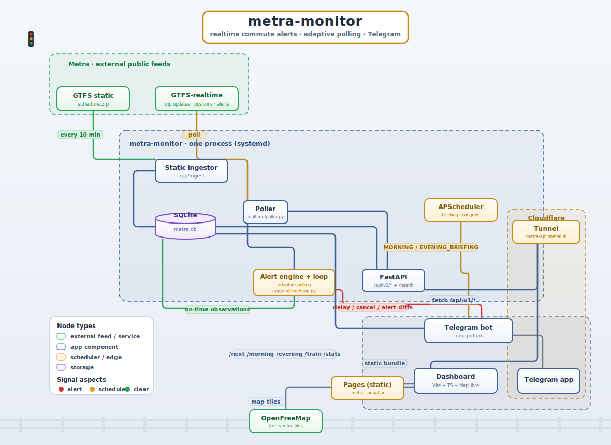

<p align="center">
  
</p>

# metra-monitor

Self-hosted commute intelligence for a single Metra line: a live Telegram bot,
a diff-based delay/cancellation alert engine, a public JSON API, and a MapLibre
dashboard, all running as one Python process against Metra's real GTFS +
GTFS-realtime feeds. No LLM involved; "agent" in the old project name was
misleading, hence the rename.

Built for a specific personal commute (MD-W line, Roselle ↔ Chicago Union
Station) but everything route/station/train-specific is config, not code.
Point it at your own line and stations via `.env`.

## What it does

- **Telegram bot**: on-demand `/next`, `/morning`, `/evening`, `/train <no>`,
  `/stats` commands, plus scheduled morning/evening briefings pushed
  automatically. See [Notification control](#notification-control-telegram)
  below for muting/scoping what gets pushed.
- **Alert engine**: pushes a message only when your train's delay *changes
  band* (on-time → minor → major), gets annulled/un-annulled, or a relevant
  GTFS service alert appears/clears. Never spams on unchanged state, respects
  configurable quiet hours and commute-mode notification windows.
- **Public JSON API** (`/api/v1/*`): summary, live positions, per-train trip
  detail, active alerts, line geometry, 30-day on-time stats. Read-only, no
  auth (your Metra API token stays server-side).
- **Dashboard**: a static Vite + TypeScript + MapLibre GL site: live map,
  hero cards for your two tracked trips, alerts ribbon, on-time stats panel.

## Notification control (Telegram)

By default the bot only pushes alerts during your actual commute, not all
day. This grew out of real usage: MD-W (and Metra generally) publishes
service alerts for *every* train on the line, not just yours, so without
this you'll get pinged about trains you don't ride at hours you don't care
about.

| Command | Effect |
|---|---|
| `/commute_mode` | **Default.** Alerts only fire before `COMMUTE_MORNING_END` or at/after `COMMUTE_EVENING_START` (see [Configuration](#configuration)). Everything in between (e.g. 9am–3pm) is hard-suppressed, no exceptions — including cancellation alerts, which otherwise bypass quiet hours. |
| `/monitor_all` | Reverts to watching MD-W all day (any train, any direction, any time within the existing awake/quiet-hours window). Use this if commute mode is too aggressive for your schedule, or you just want the old always-on behavior back. |
| `/pause_today` | Mutes *everything* — realtime alerts and the scheduled morning/evening briefings — for the rest of today. Auto-resumes tomorrow morning; no need to remember to turn it back on. |
| `/resume` | Cancels an active `/pause_today` early, same day. |
| `/status` | Shows the current mode and whether you're paused. |

**Direction-aware filtering**: in commute mode, a GTFS service alert that
explicitly names a direction (inbound/outbound, via the realtime feed's
`informed_entity.direction_id` or its nested trip descriptor) gets dropped if
it doesn't match the commute window currently active — e.g. an alert tagged
outbound (Chicago→home) won't interrupt your morning inbound commute, even
though it arrives inside the morning window. This depends on Metra's live
feed actually tagging alerts with a direction; when it doesn't (plenty of
service alerts are route-wide with no direction attached), the alert is kept
and the time-window gate alone decides whether it reaches you.

Mode and pause state are stored in the SQLite `meta` table, so they survive
process restarts and scheduled schedule-data rebuilds (the periodic
`static_ingest` job that checks Metra's `published.txt` every 10 minutes).

## Architecture

<p align="center">
  
</p>

## Requirements

- Python 3.12+
- [`uv`](https://docs.astral.sh/uv/) for dependency management
- A Telegram bot token + your own chat ID (for the bot/briefings/alerts;
  optional, everything else works without it)
- A Metra GTFS-realtime API token (optional; without one, the app still
  serves the static schedule and CLI commands, just with no live delay data)

## Install

```bash
git clone <this-repo-url> metra-monitor
cd metra-monitor
uv sync
cp .env.example .env
```

Edit `.env` (see [Configuration](#configuration) below), then:

```bash
uv run metra ingest    # downloads Metra's schedule.zip, builds the local SQLite DB
uv run metra resolve   # prints today's resolved morning/evening trips
uv run metra delays    # + one realtime poll, prints live delay per train
```

Run the full app (API + Telegram bot + scheduler + alert engine, one process):

```bash
uv run uvicorn app.main:app --host 127.0.0.1 --port 8010
```

Run the tests:

```bash
uv run pytest
```

Run the dashboard locally (against the API above):

```bash
cd dashboard
npm install
npm run dev   # http://localhost:5173, reads http://localhost:8010 via .env.development
```

## Configuration

Everything specific to *your* commute lives in `.env` (see `.env.example` for
the full list with inline comments). The essentials:

| Key | What it is |
|---|---|
| `ROUTE_ID` | Metra route id, e.g. `MD-W` (see `routes.txt` in Metra's GTFS static feed for the full list of lines) |
| `HOME_STOP` | GTFS `stop_id` for your home station; look it up in `stops.txt` after your first `metra ingest`, or query the `stops` table in the generated `metra.db` |
| `WORK_STOP` | GTFS `stop_id` for your work-end station, e.g. `CUS` for Chicago Union Station |
| `MORNING_TRAIN` | Your usual morning train number (`trip_short_name`) departing `HOME_STOP` |
| `EVENING_DEPART_CUS` | `HH:MM` departure time from `WORK_STOP` that identifies your evening train; resolved by time, not train number, since Metra renumbers trains between schedule seasons |
| `MORNING_BRIEFING` / `EVENING_BRIEFING` | `HH:MM`: when the Telegram bot pushes each daily briefing |
| `QUIET_HOURS` | `HH:MM-HH:MM` window during which non-critical alerts are suppressed |
| `COMMUTE_MORNING_END` / `COMMUTE_EVENING_START` | `HH:MM` bounds of the default `/commute_mode` alert window (before the first, at/after the second); see [Notification control](#notification-control-telegram) |
| `CORS_ORIGIN` | The origin your dashboard is served from, e.g. `https://your-dashboard-domain.example`; required so the API accepts browser requests from it |
| `METRA_API_TOKEN` | GTFS-realtime API token; register for one via Metra's developer program; leave blank to run schedule-only with no live delay data |
| `TELEGRAM_BOT_TOKEN` / `TELEGRAM_CHAT_ID` | From [@BotFather](https://t.me/BotFather) and your own chat id (e.g. via `@userinfobot`); leave blank to disable the bot entirely |

You don't need to guess your stop_ids up front; run `uv run metra ingest`
first with placeholder values, then inspect `stops.txt`/`metra.db`'s `stops`
table for the exact `stop_id` for your station, and update `.env`.

## Deploying

`docs/deploy.md` (not tracked in this repo; see the file locally if you have
it, or write your own) covers a reference self-hosted setup: a small VM
running the app behind a reverse tunnel, plus the dashboard as a static site.
The app binds to localhost only and expects a reverse proxy / tunnel in front
of it for public exposure; `deploy.sh` and `systemd/metra-monitor.service` are
included here as a starting point for a systemd-managed deployment.

## Data attribution

Schedule and realtime data comes from Metra's public GTFS and GTFS-realtime
feeds, redistributed here per Metra's data license terms. Not affiliated with
or endorsed by Metra.

## License

MIT, see `LICENSE`.
